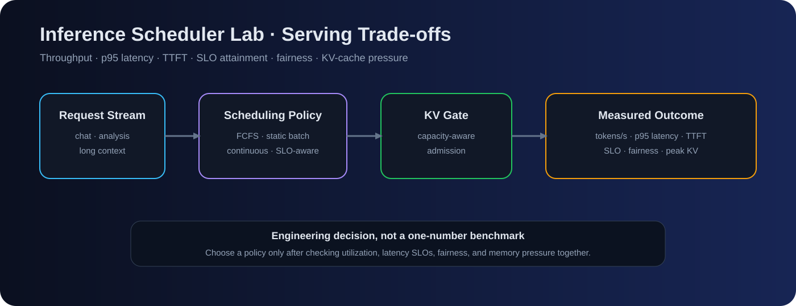
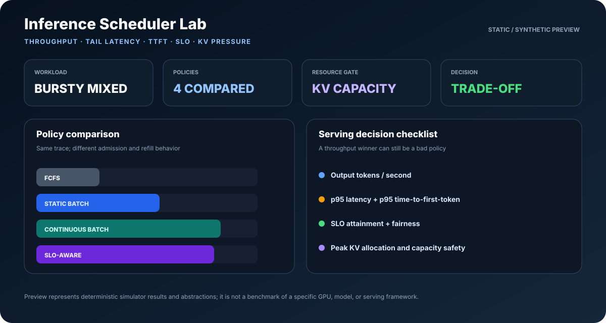
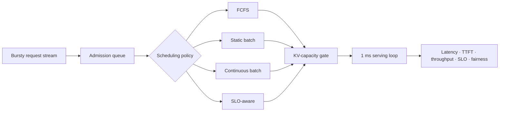

<div align="center">

# ⚙️ Inference Scheduler Lab

### LLM Serving · Continuous Batching · SLO-Aware Admission · KV-Cache Pressure

**A deterministic systems experiment for comparing inference scheduling policies on the same bursty workload—without hiding trade-offs behind one latency number.**

[](https://github.com/VinayK88/inference-scheduler-lab/actions/workflows/tests.yml)


**generate → admit → batch → serve → measure → compare**

[Experiment](#the-question) · [Policies](#policies-under-test) · [Results](#checked-in-example) · [Quick Start](#quick-start)

</div>

<p align="center"></p>

<p align="center"></p>

---

## The question

> **How should an inference server admit and batch mixed chat, analysis, and long-context requests when accelerator work and KV-cache capacity are finite?**

The lab compares multiple policies on the **same deterministic bursty trace** while tracking:

```text
throughput
p95 latency
p95 time-to-first-token
SLO attainment
fairness
peak KV-cache pressure
```

The goal is an engineering decision, not a leaderboard.

## 60-second reviewer path

1. Scan the system overview above.
2. Compare the [four policies](#policies-under-test).
3. Inspect the [policy frontier](#policy-frontier).
4. Read the [checked-in example](#checked-in-example) as a trade-off, not a hardware claim.
5. Reproduce the experiment with one command.

## Experiment architecture



## Policies under test

| Policy | Admission behavior | Expected trade-off |
|---|---|---|
| **FCFS** | One request at a time | Simple, but head-of-line blocking and weak utilization |
| **Static batch** | Fill only when the batch is empty | Better utilization, but delayed refill |
| **Continuous batch** | Refill open slots every millisecond | High utilization under mixed sequence lengths |
| **SLO-aware** | Refill using estimated deadline slack | Protects urgent work; can trade aggregate fairness / throughput |

## Policy frontier

<p align="center"></p>

A useful policy should improve accelerator utilization **without silently violating latency SLOs or overcommitting KV memory**. Throughput, latency, SLO attainment, fairness, and resource pressure should be read together.

## Checked-in example

| Policy | Output tok/s | p95 latency | p95 TTFT | SLO met | Peak KV |
|---|---:|---:|---:|---:|---:|
| FCFS | 6,469 | 932 ms | 930 ms | 21.2% | 18.8% |
| Static batch | 14,737 | 189 ms | 188 ms | 83.1% | 80.3% |
| Continuous batch | **18,398** | 82 ms | 77 ms | **100.0%** | 100.0% |
| SLO-aware | 18,138 | **80 ms** | **71 ms** | **100.0%** | 100.0% |

On this seeded synthetic trace, continuous batching delivers **2.84× FCFS throughput**. The SLO-aware policy gives up about **1.4%** of that throughput while slightly improving p95 latency and TTFT.

These are **simulator results, not GPU or production-serving benchmarks**.

## Modeling choices

The simulator deliberately exposes its abstractions:

- Requests reserve full prompt-plus-generation KV footprint at admission.
- Aggregate token work improves logarithmically with active batch size.
- Service is shared across active sequences.
- Prefill and decode consume the same abstract token-work budget.
- TTFT is recorded when decode begins.
- Workloads and results are deterministic by seed so policy changes are reviewable in CI.

These choices make resource invariants easy to audit, but the lab does **not** claim to reproduce a specific GPU, kernel, model architecture, speculative decoder, vLLM deployment, or TensorRT-LLM stack.

## Quick start

```bash
python -m venv .venv
source .venv/bin/activate
python -m pip install -e .

inference-scheduler-lab
```

The default run writes:

- `reports/baseline.json` — workload, server configuration, policy metrics, and deltas;
- `assets/policy-frontier.svg` — GitHub-renderable trade-off visual.

Run a smaller reproducible experiment:

```bash
inference-scheduler-lab --requests 80 --seed 17 \
  --output reports/small.json \
  --visual assets/small-frontier.svg
```

Run tests:

```bash
python -m unittest discover -s tests -v
```

## Repository map

```text
src/inference_scheduler_lab/
├── workload.py      deterministic mixed workload generator
├── simulator.py     admission, KV gating, service loop, metrics
├── experiment.py    policy comparison and baseline deltas
├── visualize.py     dependency-free SVG frontier
└── cli.py           reproducible experiment entry point

tests/               invariants, determinism, policy checks
reports/             generated JSON evidence
assets/              dashboard + scheduling visuals
```

## Production evolution

High-value next experiments:

1. Add preemption and quantify wasted prefill work.
2. Add prefix-aware admission and cache locality.
3. Replay anonymized real serving traces.
4. Calibrate service curves against vLLM or TensorRT-LLM measurements.
5. Add energy/token and SLO miss rate as constrained objectives.
6. Extend to multi-GPU placement and heterogeneous accelerators.

## Why this belongs in an AI-systems portfolio

The project makes a falsifiable systems claim, records the configuration behind it, tests resource invariants, compares competing policies, and clearly states where the abstraction ends.

---

<div align="center">

**Serving quality is a multi-objective systems problem: utilization is useful only when latency, fairness, and memory remain acceptable.**

</div>
