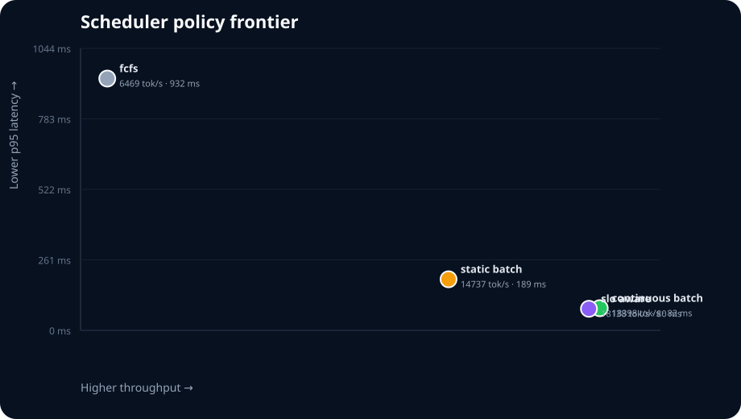
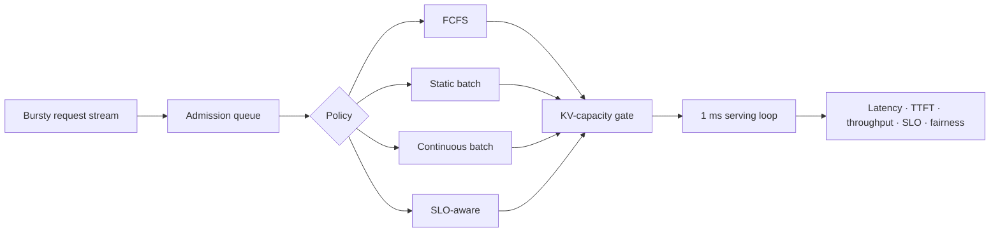

# Inference Scheduler Lab

> A deterministic systems experiment for reasoning about LLM serving—not a toy queue with one latency number.

[](https://github.com/VinayK88/inference-scheduler-lab/actions/workflows/tests.yml)


This lab compares four scheduling policies on the **same bursty workload** while tracking throughput, tail latency, time-to-first-token, SLO attainment, fairness, and KV-cache pressure. The simulator is small enough to audit line by line and rich enough to make the trade-offs visible.



## The question

How should an inference server admit and batch mixed chat, analysis, and long-context requests when accelerator work and KV-cache capacity are finite?



## Policies under test

| Policy | Admission behavior | Expected trade-off |
|---|---|---|
| `fcfs` | One request at a time | Simple, but poor utilization and head-of-line blocking |
| `static_batch` | Fill only when the batch is empty | Better utilization, delayed refill |
| `continuous_batch` | Refill open slots every millisecond | High utilization under mixed sequence lengths |
| `slo_aware` | Refill by estimated deadline slack | Protects urgent work, may trade aggregate fairness |

## Run it

```bash
python -m venv .venv
source .venv/bin/activate
python -m pip install -e .
inference-scheduler-lab
```

The command writes:

- `reports/baseline.json` — machine-readable workload, server settings, and metrics
- `assets/policy-frontier.svg` — a GitHub-renderable throughput/tail-latency plot

Try a smaller reproducible experiment:

```bash
inference-scheduler-lab --requests 80 --seed 17 \
  --output reports/small.json --visual assets/small-frontier.svg
```

## Example interpretation

Read the output as an engineering decision, not a leaderboard. A useful policy should improve accelerator utilization without silently violating the latency SLO or overcommitting KV memory. Compare `throughput_gain_vs_fcfs` with `p95_latency_change_vs_fcfs`, then inspect SLO attainment and fairness before choosing a winner.

| Policy | Output tok/s | p95 latency | p95 TTFT | SLO met | Peak KV |
|---|---:|---:|---:|---:|---:|
| FCFS | 6,469 | 932 ms | 930 ms | 21.2% | 18.8% |
| Static batch | 14,737 | 189 ms | 188 ms | 83.1% | 80.3% |
| Continuous batch | 18,398 | 82 ms | 77 ms | 100.0% | 100.0% |
| SLO-aware | 18,138 | 80 ms | 71 ms | 100.0% | 100.0% |

On this seeded synthetic trace, continuous batching delivers 2.84× FCFS throughput. The SLO-aware policy gives up 1.4% of that throughput while slightly improving p95 latency and TTFT. These are simulator results, not hardware benchmarks.

## Modeling choices

- Requests reserve their full prompt-plus-generation KV footprint at admission, preventing hidden overcommit.
- Aggregate token work improves logarithmically with batch size, then is shared fairly across active sequences.
- Prefill and decode consume the same abstract token-work budget. TTFT is recorded when decode begins.
- Every workload and result is deterministic by seed, making policy changes reviewable in CI.

These are deliberate abstractions. This project does **not** claim to reproduce a specific GPU, kernel, model architecture, speculative decoder, or production serving stack. The next validation step would calibrate service curves against measurements from vLLM or TensorRT-LLM and add prefix-cache hit rates, preemption cost, and multi-GPU placement.

## Repository map

```text
src/inference_scheduler_lab/
├── workload.py      # deterministic mixed workload generator
├── simulator.py     # admission, KV gating, service loop, metrics
├── experiment.py    # policy comparison and baseline deltas
├── visualize.py     # dependency-free SVG frontier
└── cli.py           # reproducible experiment entry point
tests/               # invariants, determinism, and policy checks
reports/             # generated JSON evidence
assets/              # generated visuals
```

## Extend the experiment

1. Add preemption and quantify wasted prefill work.
2. Implement prefix-aware admission and simulate cache locality.
3. Replay a real anonymized trace instead of the synthetic workload.
4. Treat SLO miss rate and energy per token as a constrained optimization problem.

## Why this belongs in an AI-systems portfolio

The code makes a falsifiable systems claim, records the configuration behind it, tests resource invariants, and shows where the abstraction stops. That combination is more informative than presenting a serving framework without an experiment.

## License

MIT
